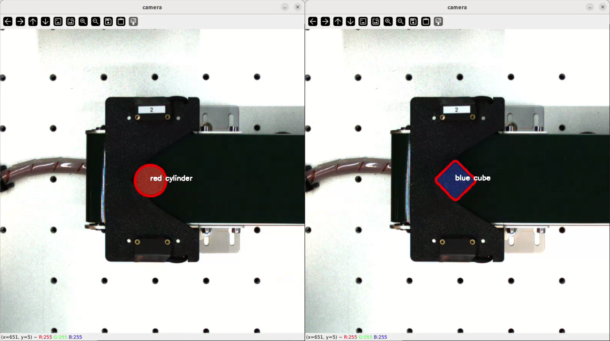

# Opencv Classification

This repository provides a basic color and shape classification using OpenCV with ROS2.

**Code is provided `as-is` and may require modifications to work with your specific hardware configuration.**

## Installation
Please refer to the [installation guide](/docs/INSTALLATION.md) for detailed instructions on setting up your development environment.

## Running the packages
Please refer to the [running guide](/docs/RUN.md) for detailed instructions on running the sample classification.